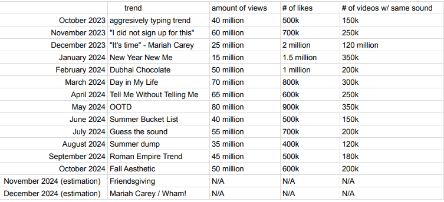
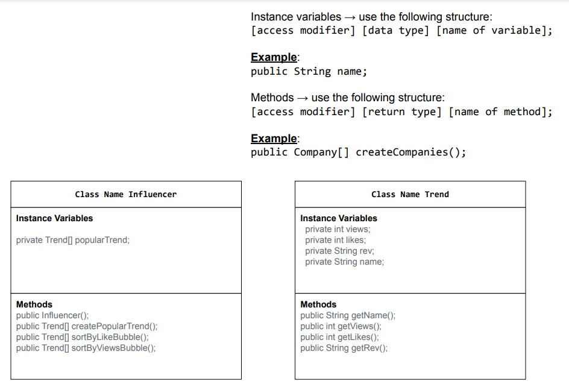

# Unit 3 - Data for Social Good Project 

## Introduction 

Software engineers develop programs to work with data and provide information to a user. Each user has different needs based on the information they are looking for from data. Your goal is to create a data analysis program for your user that stores and analyzes data to provide the information they need. 

## Requirements 

Use your knowledge of object-oriented programming, one-dimensional (1D) arrays, and algorithms to create your data analysis program: 
- **Write a class** – Write a class to represent your user or business and store and analyze their data with no-argument and parameterized constructors. 
- **Create at least two 1D arrays** – Create at least two 1D arrays to store the data that your user needs information about. 
- **Write a method** – Write a method that finds or manipulates the elements in a 1D array to provide the information your user needs. 
- **Implement a toString() method** – Write a toString() method that returns general information about the data (for example, number of values in the dataset). 
- **Document your code** – Use comments to explain the purpose of the methods and code segments and note any preconditions and postconditions. 

## User Story 

Include your User Story you analyzed for your project here. Your User Story should have the following format: 

> As TikTok influencer   
> I want to analyze user interaction with trends,   
> so that I can the most amount of views possible. This leads to more money.

## Dataset 

Include a hyperlink to the source of your dataset used for this project. Additionally, provide a short description of each column used from the dataset, and the data type. 

Dataset: 

The dataset was created using this link: https://slayingsocial.com/tiktok-trends-right-now/ 

> We found a link to find the popular trends that we wanted to analyze but my partner and I made our own research  
> to find the rest of the information such as views, likes, and revenue.
- **Name** (String) - name of the trends listed
- **Likes** (int) - number likes for each trend
- **Revenue** (String) - estimated revenue for the trend
- **Views** (int) - estimated views for each trend

## UML Diagram 

Put and image of your UML Diagram here. Upload the image of your UML Diagram to your repository, then use the Markdown syntax to insert your image here. Make sure your image file name is one work, otherwise it might not properly get display on this README. 

![UML Diagram for my project]

## Description 

Write a description of your project here. In your description, include as many vocab words from our class to explain your User Story, the chosen dataset and how your project addressed that users goals. If your project used the Scanner class for user input, explain how the user will interact with your project.

> Our user story is about an influencer who wants to become a big name on social media and make a living out of it.  
> To do that, the influencer needs to analyze user interaction with trends and find what trend the influencer needs to keep up with.  
> The influencer finds a list of trends that are popular over the year, however, the influencer isn't sure which trend is the most popular to participate in.  
> Using our code, the influencer finds the information of each trend and organizes it based on likes or views.  
> After organizing it, the influencer can see which trend is the most popular based on user interaction and the estimated revenue to participate in a trend.  